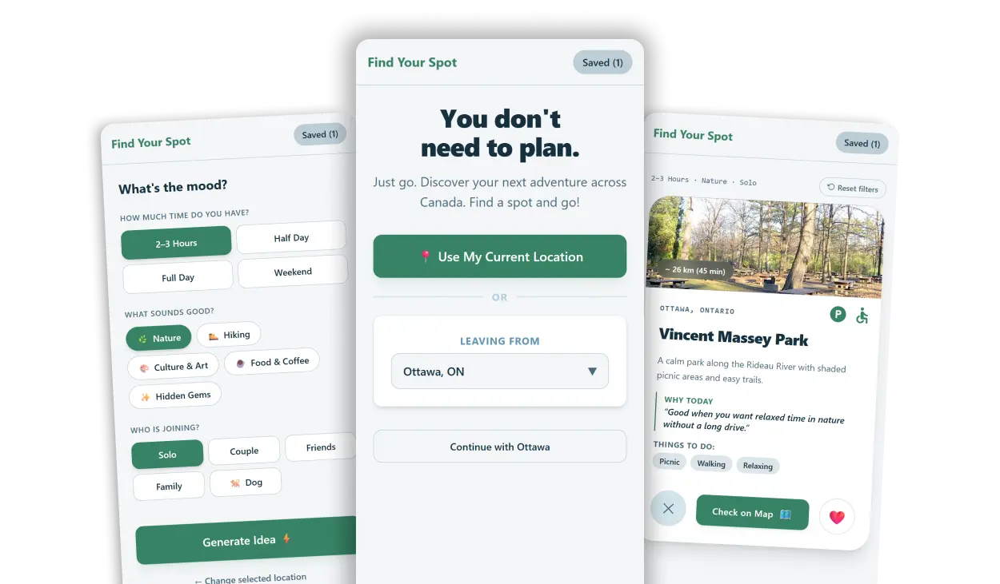

<p align="center">
  
</p>

# Find Your Spot

Find Your Spot is a location-aware discovery app that turns “what should we do?” into a few quick choices and a curated deck of nearby destinations. Pick how much time you have, what kind of vibe you're after, and who's coming along, then browse through a deck of curated local spots and save the ones you like.

Currently live for **Ottawa, ON** — more Canadian cities coming soon.

## Features

- **Quick mood-based filtering** — duration, vibe, and companions, no long forms
- **Save & manage a shortlist** — bookmark spots, remove them, or clear the whole list
- **Location-aware discovery** — use your current location or choose a starting city to see approximate distances to nearby spots
- **One-tap directions** — jump straight into maps for navigation
- **Responsive UI** — designed mobile-first, scales up to desktop

## App Flow

1. **Welcome** — the user shares their location (or picks a city) as the starting point.
2. **Onboarding** — the user picks how much time they have, the vibe they're after, and who's joining, then generates a deck.
3. **Cards** — the user browse through destination cards, saving the ones they like.
4. **Saved** — a shortlist of saved places, with the option to get directions, remove entries, or start over.

State for the current step and all filters lives in `AppContext`, so any component can read or update it without prop drilling.

## Tech Stack

- [React](https://react.dev/)
- [Vite](https://vitejs.dev/)
- [Tailwind CSS](https://tailwindcss.com/)
- JavaScript
- React Context API for app-wide state
- [react-icons](https://react-icons.github.io/react-icons/)

## Getting Started

### Prerequisites

- Node.js 18+
- npm (or yarn/pnpm)

### Installation

```bash
git clone <https://github.com/Camperkunz/Find-Your-Spot>
cd Find-Your-Spot
npm install
```

### Development

```bash
npm run dev
```

The app will be available at `http://localhost:5173` by default.

### Build

```bash
npm run build
```

### Preview production build

```bash
npm run preview
```

## Project Structure

```
src/
├── App.jsx                    # Top-level app flow
├── App.css
├── context/
│   └── AppContext.jsx         # Global state, LocalStorage
├── components/
│   ├── ui/
│   │   ├── Layout.jsx         # Page shell
│   │   ├── Header.jsx
│   │   ├── Footer.jsx
│   │   └── Modal.jsx
│   └── elements/
│       └── Card.jsx
├── steps/
│   ├── Welcome.jsx            # City selection / geolocation
│   ├── Onboarding.jsx         # Duration / vibe / companion filters
│   └── Saved.jsx              # Saved places list
├── logic/
│   ├── categories.js          # Static option data
│   ├── sorting.js             # Destination filtering logic
│   └── maps.js                # Directions / maps integration
└── data/
    └── ottawa_destinations.json
```

## Contributing

Issues and pull requests are welcome. Please open an issue first to discuss significant changes.

## License

© 2026 Anna Nikiforova. All rights reserved.

This project is not licensed for reuse. The repository is publicly available for portfolio and demonstration purposes only. Viewing the source code is permitted; copying, modifying, redistributing, or using the code or substantial portions of it requires explicit written permission from the author.
